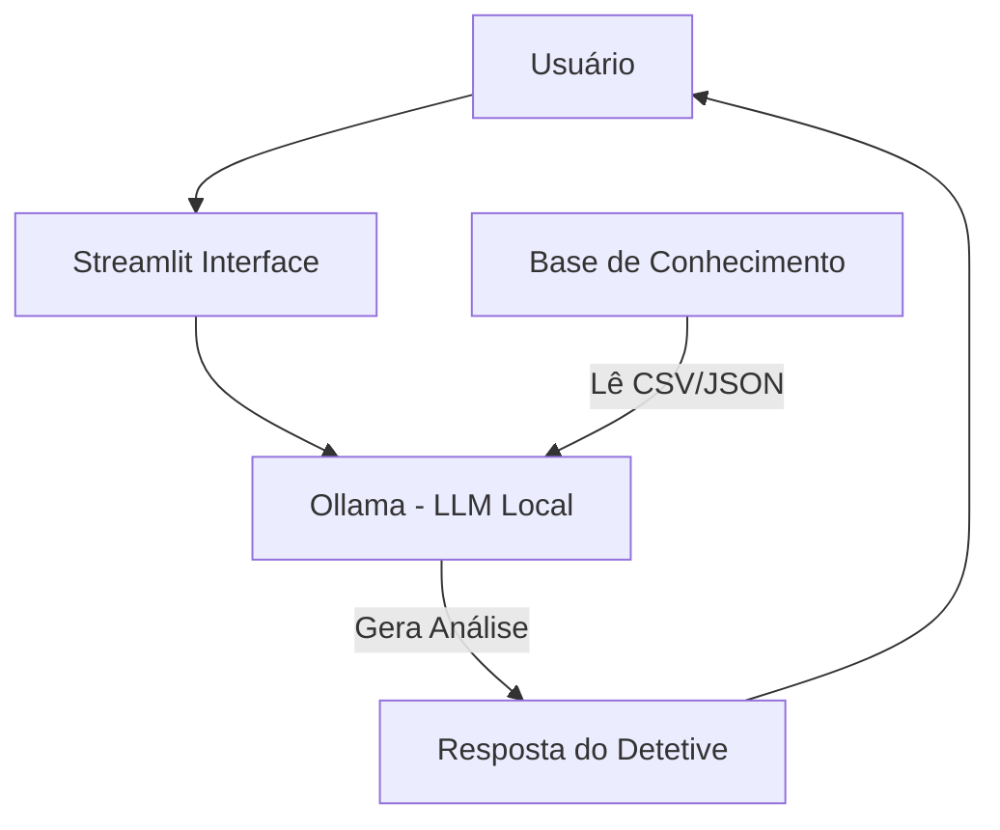

# 🕵️‍♂️ Lupa - O Detetive Financeiro

> Agente de IA Generativa que atua como um auditor de finanças pessoais. Ele analisa históricos de transações, encontra padrões de gastos ocultos ("vazamentos") e alerta o usuário antes que o orçamento estoure.

## 💡 O Que é o Lupa?

Diferente de assistentes genéricos que apenas respondem dúvidas, o Lupa é um **investigador ativo**. Ele cruza os dados do seu extrato bancário com o seu perfil financeiro para encontrar onde o dinheiro está sendo desperdiçado.

**O que o Lupa faz:**
- ✅ **Auditoria:** Lê arquivos CSV e categoriza gastos automaticamente.
- ✅ **Detecção:** Identifica padrões de consumo excessivo (ex: "Você gastou 30% em delivery").
- ✅ **Proatividade:** Alerta sobre riscos ao orçamento baseando-se em dados reais.
- ✅ **Privacidade:** Roda 100% localmente, sem enviar dados bancários para a nuvem.

**O que o Lupa NÃO faz:**
- ❌ Não executa transferências ou pagamentos.
- ❌ Não inventa transações (usa *Grounding* estrito no CSV).
- ❌ Não dá recomendações de investimento de alto risco (foca em organização).

## 🏗️ Arquitetura



**Stack Tecnológico:**
- **Interface:** Streamlit (Python)
- **Cérebro (LLM):** Ollama (Modelo `llama3`)
- **Manipulação de Dados:** Pandas (Para cálculos matemáticos precisos)
- **Dados:** Arquivos CSV e JSON locais

## 📁 Estrutura do Projeto

```
├── data/                          # A "Cena do Crime" (Dados)
│   ├── perfil_investidor.json     # Quem é o usuário
│   ├── transacoes.csv             # O rastro do dinheiro (Extrato)
│   ├── historico_atendimento.csv  # Memória de conversas
│   └── produtos_financeiros.json  # Soluções de investimento
│
├── docs/                          # Documentação do Projeto
│   ├── 01-documentacao-agente.md  # Definição da Persona
│   ├── 02-base-conhecimento.md    # Estratégia RAG
│   ├── 03-prompts.md              # Engenharia de Prompt (System)
│   ├── 04-metricas.md             # Testes de Assertividade
│   └── 05-pitch.md                # Roteiro do Vídeo
│
└── src/
    └── app.py                     # O Código do Agente (Streamlit)
```

## 🚀 Como Executar

### 1. Preparar o Cérebro (Ollama)

Certifique-se de ter o [Ollama](https://ollama.com) instalado.

```bash
# Baixar o modelo Llama 3 (usado neste projeto)
ollama pull llama3

# Iniciar o servidor (se não estiver rodando)
ollama serve
```

### 2. Instalar Ferramentas

```bash
pip install streamlit pandas requests
```

### 3. Iniciar a Investigação

```bash
streamlit run src/app.py
```

## 🎯 Exemplos de Uso

**Usuário:** "Para onde foi meu dinheiro em outubro?"
**Lupa:** "Analisei as evidências. 🕵️‍♂️ Você gastou **R$ 1.380,00 em Moradia** e **R$ 570,00 em Alimentação**. Atenção: seus gastos com Lazer representam apenas 1% do total, o que é muito baixo para um perfil equilibrado."

**Usuário:** "Sobrou dinheiro?"
**Lupa:** "Investigação concluída. Considerando sua renda de R$ 5.000,00 e despesas de R$ 2.488,90, temos um saldo positivo. Recomendo alocar esse excedente na sua **Reserva de Emergência** (Tesouro Selic), conforme seu objetivo principal."

## 📊 Métricas de Qualidade

| Métrica | Objetivo no Lupa |
|---------|------------------|
| **Precisão Matemática** | O total de gastos informado bate 100% com a soma do Excel? (Garantido via Pandas) |
| **Anti-Alucinação** | O agente se recusa a inventar gastos que não estão no CSV? |
| **Persona** | O tom de voz se mantém analítico e investigativo ("Detetive")? |

## 🎬 Diferenciais

- **Análise Real:** Não é apenas um chat, é um analista de dados que "fala".
- **Privacidade Total:** Como usa LLM Local, seus dados financeiros nunca saem do seu computador.
- **Cálculo Híbrido:** Usa Python para somas (exatidão) e LLM para explicação (didática).

## 📝 Créditos

Desenvolvido por **Samuel Maggi** durante o **Bootcamp GenIa & Dados (DIO + Bradesco)**.
Documentação completa disponível na pasta [`docs/`](./docs/).
